# ZandrEA Application Architecture

## AFDD System for HVAC Equipment Surveillance

<!-- This is a note: ZandrEA is an Arc Fault Detection and Diagnosis system for HVAC equipment surveillance -->

---

# Architecture Overview

<div class="text-sm">

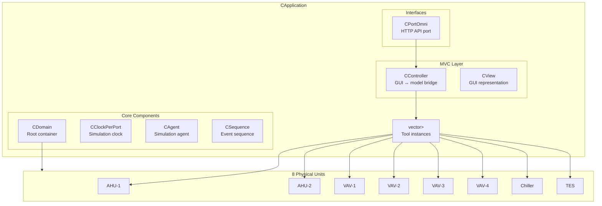

</div>

<!-- Notes:
- Top-level view of the entire application
- CApplication bootstraps everything in tool.cpp:3786
- 8 tool instances manage 8 physical units
- MVC pattern separates controller, view, and model
-->

---
layout: two
---

# Core Principle: One Tool Per Unit

<div class="pt-4">

Each tool instance owns **one subject** and manages all surveillance (AFDD) logic for that unit.

</div>

<div class="pt-4">

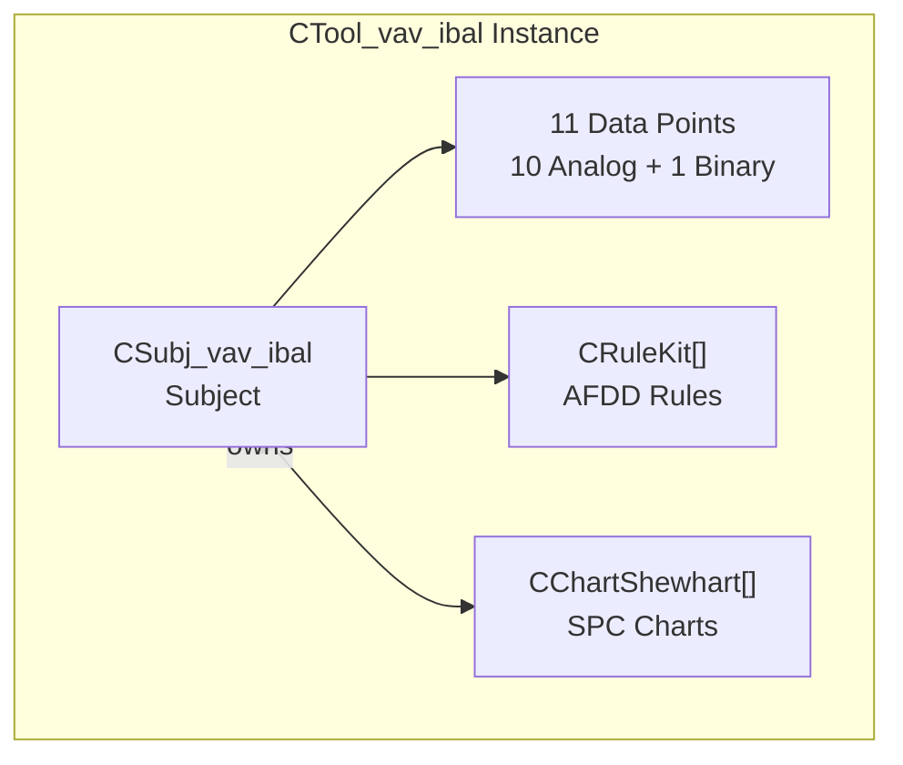

</div>

<!-- Notes:
- Each CTool maps to exactly one ASubject
- The subject owns its points, rules, and charts
- No sharing between units — complete isolation
-->

---

# Subject Hierarchy

<div class="text-sm">

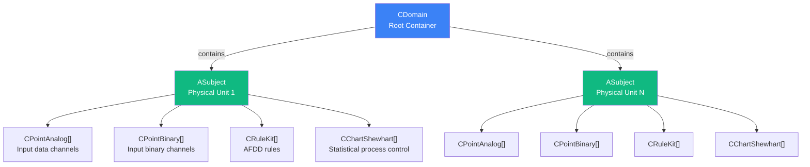

</div>

<!-- Notes:
- CDomain is the root container for all subjects
- Each subject represents one physical piece of equipment
- Points, rules, and charts are all owned by the subject
-->

---

# Concrete Subject Types

<div class="text-sm">

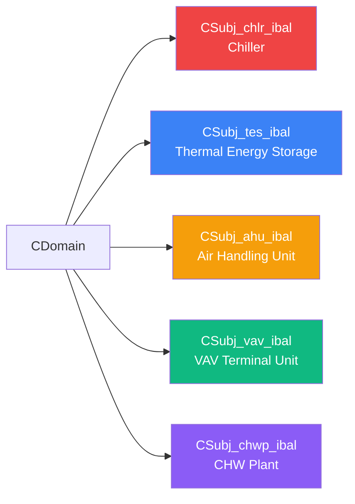

</div>

<div class="text-sm mt-4">

Each subject has:
- A unique **`NGuiKey`** (`unsigned long long`)
- An **`ERealName`** (enum-based identifier)

</div>

---

# Equipment Topology

<div class="text-sm">

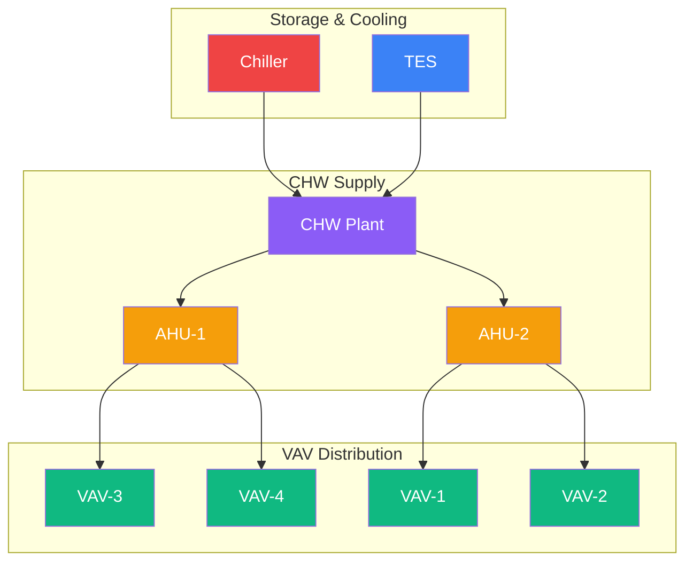

</div>

<!-- Notes:
- Arrows show antecedent relationships
- VAVs depend on their parent AHU
- AHUs depend on the CHW plant
- Chiller and TES feed the CHW plant
-->

---
layout: two
---

# VAV Point Inventory (11 per unit)

<div class="pt-4 text-sm">

```mermaid
graph TD
    VAV["VAV Unit"] -->|"1"| Pressure["Pressure_static_air_supply"]
    VAV -->|"2"| TempSupply["Temperature_air_supply"]
    VAV -->|"3"| TempDisch["Temperature_air_discharge"]
    VAV -->|"4"| TempZone["Temperature_air_zone"]
    VAV -->|"5"| SetptHtg["Temperature_air_zone_setpt_htg"]
    VAV -->|"6"| SetptClg["Temperature_air_zone_setpt_clg"]
    VAV -->|"7"| ValveHW["Position_valve_hw"]
    VAV -->|"8"| Damper["Position_damper_vav"]
    VAV -->|"9"| FlowVAV["FlowRateVolume_air_vav"]
    VAV -->|"10"| FlowSetpt["FlowRateVolume_air_vav_setpt"]
    VAV -->|"11"| Occupied["Binary_zoneOccupied"]

    style VAV fill:#10b981,color:#fff
    style Occupied fill:#ef4444,color:#fff
```

</div>

<!-- Notes:
- 10 analog points + 1 binary point
- Order matters for data reading and GUI display
- Each point is a CPointAnalog or CPointBinary -->

---

# Point Registration Flow

<div class="text-sm">

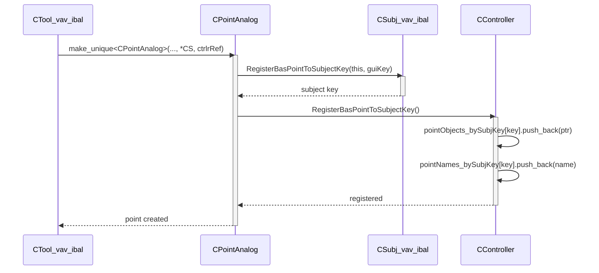

</div>

<!-- Notes:
- Points self-register during construction
- Controller maintains parallel maps by subject key
- Two vectors: object pointers and name enums
- Order matches declaration order in tool constructor
-->

---

# Controller Data Maps

<div class="text-sm">

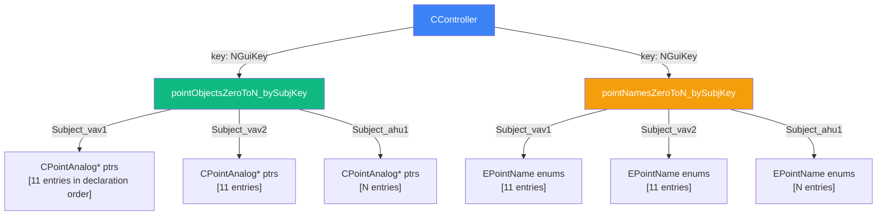

</div>

---
layout: two
---

# Data Flow: Input Pipeline

<div class="pt-4 text-sm">

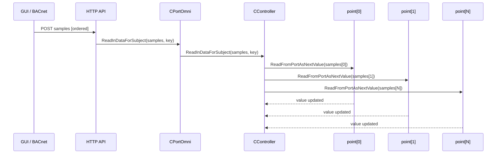

</div>

<!-- Notes:
- Samples must be in exact declaration order
- Controller iterates pointObjects_bySubjKey map
- Each point reads its next value from the samples array
-->

---

# Data Flow: AFDD Processing

<div class="text-sm">

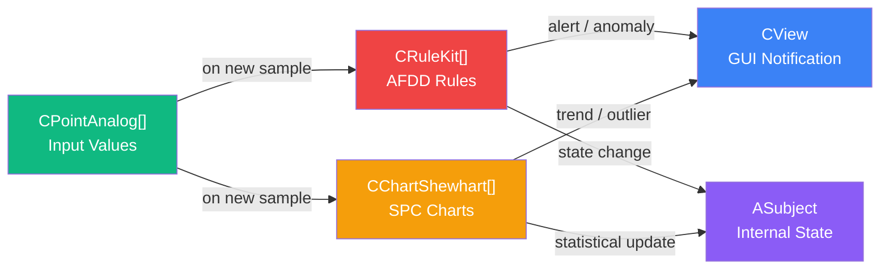

</div>

<!-- Notes:
- New samples trigger both rules and charts
- Rules check for AFDD conditions
- Charts track statistical process control
- Both feed into the GUI for visualization
-->

---

# Full Application Bootstrap

<div class="text-xs">

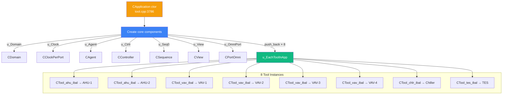

</div>

---

# Adding a New VAV — Step 1: Enum

<div class="text-sm">

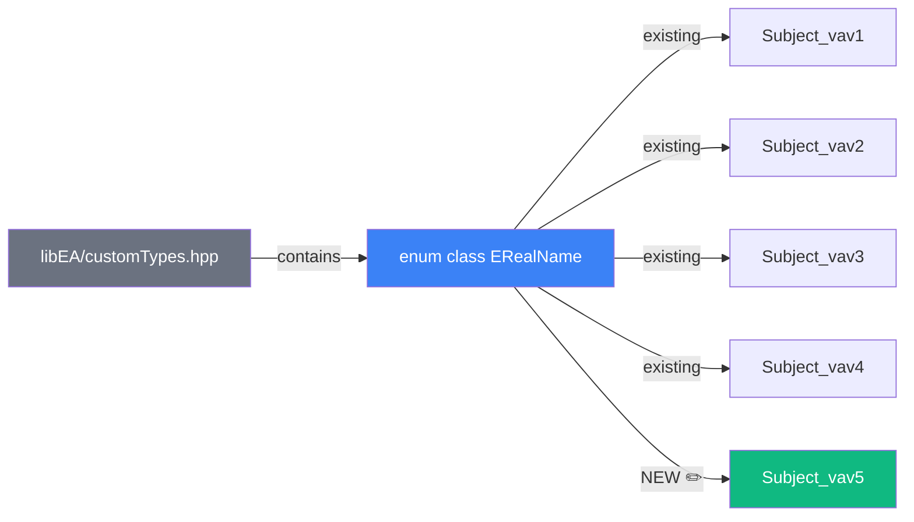

</div>

<div class="text-sm mt-4">

```cpp
enum class ERealName : unsigned int {
   // ... existing entries ...
   Subject_vav4,
   Subject_vav5,       // ← add new VAV name
};
```

</div>

---

# Adding a New VAV — Step 2: Instantiation

<div class="text-sm">

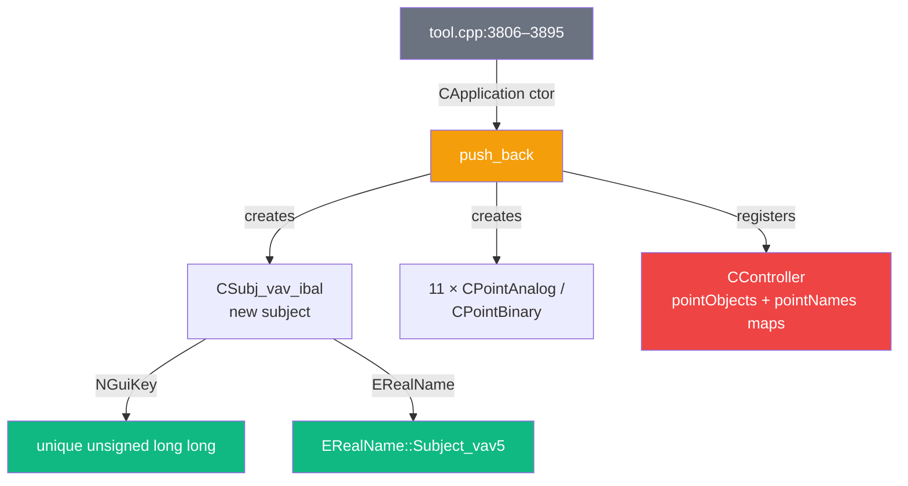

</div>

<div class="text-sm mt-4">

```cpp
u_EachToolInApp.push_back(
    std::make_unique<CTool_vav_ibal>(
        unitSys, *u_Domain,
        EDataLabel::Subject_vav_pressIndep_hwReheat,
        ERealName::Subject_vav5,   // ← unique name
        ERealName::Subject_ahu1,   // ← antecedent AHU
        ERealName::Subject_hwPlant_sim,
        *u_Clock, *u_Seq0, *u_Ctrlr, *u_View, *u_OmniPort
    )
);
```

</div>

---

# Adding a New VAV — Step 3: GUI Display

<div class="text-sm">

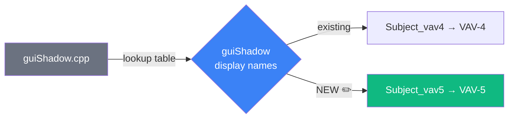

</div>

<div class="text-sm mt-4">

```cpp
{ ERealName::Subject_vav4, "VAV-4" },
{ ERealName::Subject_vav5, "VAV-5" },   // ← add display name
```

</div>

---

# Adding a New VAV — What You DON'T Touch

<div class="text-sm">

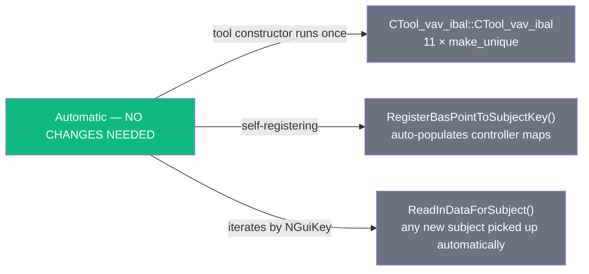

</div>

---

# Summary: 3 Touch Points

<div class="text-sm">

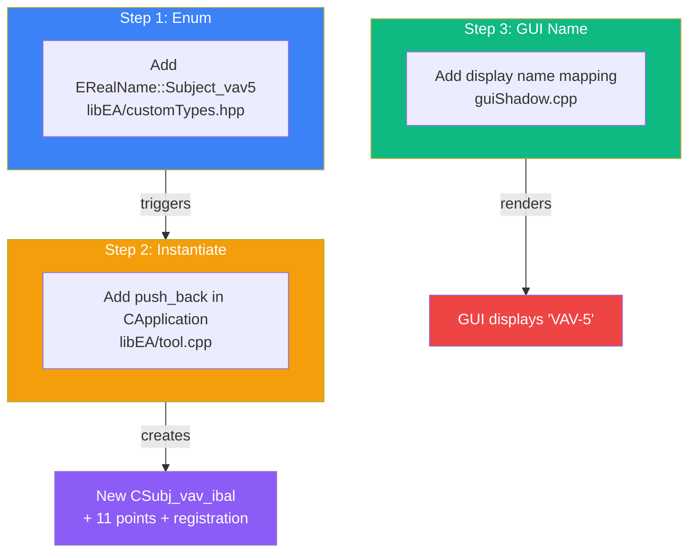

</div>

---

# Architecture Summary

<div class="text-sm">

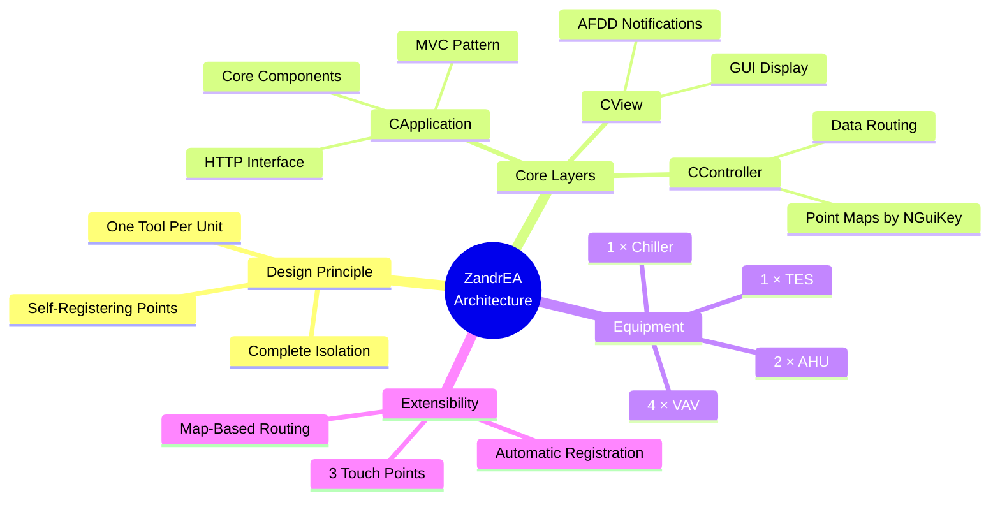

</div>

<!-- Notes:
- Key takeaway: the architecture is designed for extensibility
- New units require changes in exactly 3 places
- Point registration and data reading are fully automatic
- Map-based routing by NGuiKey means no loops needed
-->

---

layout: center
class: text-center
---

# Questions?

<!-- Notes:
- End of architecture overview
- Reference libEA/tool.cpp for the full implementation
-->
